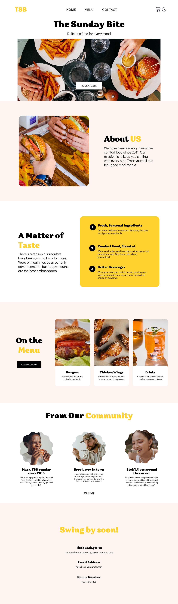

# 🍔 The Sunday Bite - Landing Page Website

> Built by Interns in Just 8 Days!

---

## 👨‍🏫 About This Project

This website is a **landing page** built by a group of students who started from **zero web coding knowledge**. In just **8 days**, they learned HTML & CSS and applied their skills to build a visually appealing and responsive restaurant website.

I guided them through each step, from understanding the basics to structuring, styling, and polishing the final design.

---

## ✨ Highlights

- ✅ Built with only **HTML & CSS**
- ✅ Fully **responsive** for all screen sizes
- ✅ Clean and modern **design**
- ✅ Based on a professional **Canva layout**
- ✅ Organized and semantic **HTML structure**
- ✅ Custom **CSS styling** with root variables

---

## 🎯 Skills Learned

- HTML5 semantic tags
- CSS layout using
- Responsive design
- Color variables and modern typography
- Image optimization and button hover effects
- Building confidence by working on a **real-world project**

---

## 🖼️ Design Reference

The full design was shared via **Canva** and used as a visual blueprint for the entire website.

📎 **Design Screenshot**:  

---

## 🚀 Live Preview
> https://tsb-hazel.vercel.app/

---

## 🛠️ Technologies Used

- HTML5  
- CSS3  
- Google Fonts  
- Font Awesome

---

## 👨‍🎓 Interns' Effort

> I'm incredibly proud of these students! With no prior web coding experience, they built this polished landing page after just 8 days of focused learning and hard work. Their dedication, teamwork, and growth truly show what’s possible with the right guidance and consistency. 💪

---

## 🙌 Instructor

**Omar Diab**  
LinkedIn: [@Omar-Diab](https://www.linkedin.com/in/omardiab1/)

---
